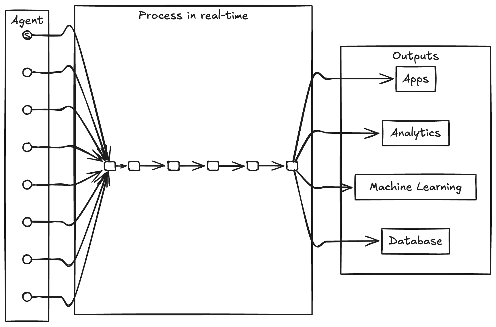
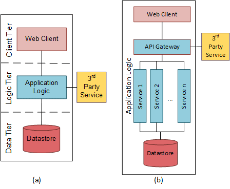
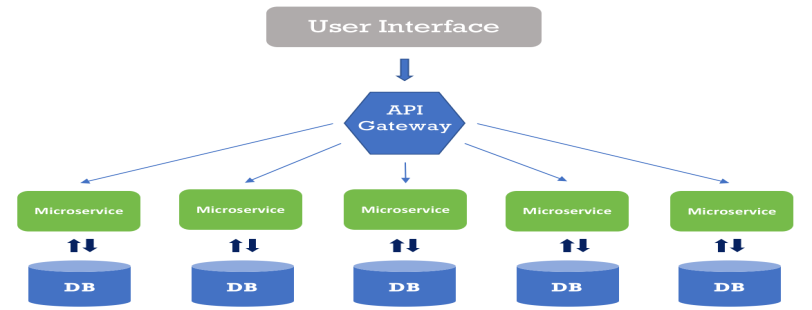
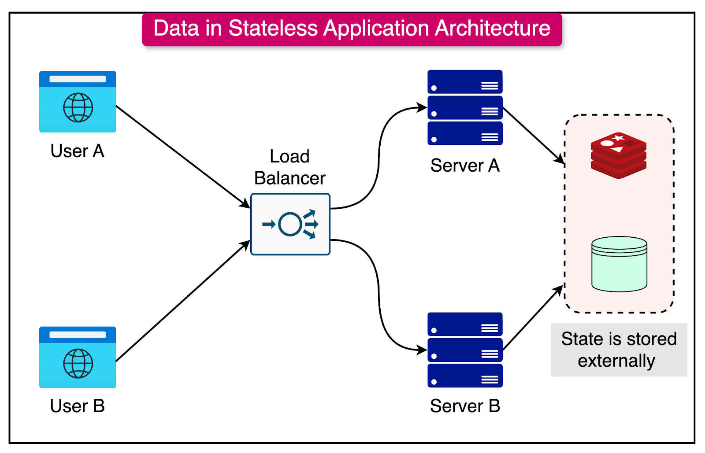
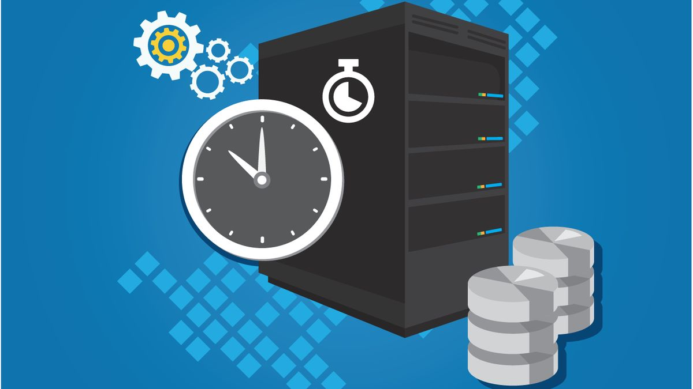

## Multi-Agent Cloud Native Distributed Architecture for AgentiaCloud

A combination of **event-driven architecture (EDA)**, **three-tier microservices architecture**, **stateless computing**, and **scheduled computing (CronJobs)** is used by AgentiaCloud for agentic AI development to meet the requirements of AI agents—such as their autonomy, real-time needs, scalability, and complexity. This mix can indeed be a powerful and practical approach for many agentic AI systems. Let’s break it down and evaluate how these paradigms align with agentic AI, which typically involves autonomous, goal-driven entities that perceive, decide, and act in an environment.

---

### What is Agentic AI?
Agentic AI refers to systems where AI "agents" operate with some degree of autonomy, making decisions and taking actions to achieve goals. These agents might:
- React to environmental changes (e.g., user inputs, sensor data).
- Perform scheduled tasks (e.g., periodic analysis).
- Coordinate with other agents or systems.
- Scale dynamically based on workload.

Examples include multi-agent systems, autonomous chatbots, or robotic process automation (RPA).

---

### Analyzing the Components

#### 1. Event-Driven Architecture (EDA)

[The Future of AI Agents: Why Event-Driven Architecture Is Essential](https://blog.spheron.network/the-future-of-ai-agents-why-event-driven-architecture-is-essential)
- **Why It Fits Agentic AI**:
  - Agents often need to **react to events**—like a user command, a sensor trigger, or a state change in another agent. EDA’s asynchronous, reactive nature aligns perfectly with this.
  - Loose coupling allows agents to operate independently, publishing events (e.g., "TaskCompleted") and subscribing to others (e.g., "NewDataAvailable") without tight dependencies.
  - Supports real-time decision-making, critical for agents in dynamic environments.
- **Use Case**: An agent monitoring stock prices reacts to a "PriceDrop" event by executing a trade, while another agent logs the action—all triggered via an event bus.

#### 2. Three-Tier and Microservices Architecture

- **Why It Fits Agentic AI**:
  - Provides a **structured yet flexible foundation**:
    - **Presentation Layer (or Service)**: Interfaces for human-agent interaction (e.g., a UI or API for configuring agents), often implemented as a lightweight microservice for scalability and responsiveness.
    - **Business Logic Layer (or Services)**: Houses the agent’s decision-making logic (e.g., rules, models, or reinforcement learning policies), now distributed across microservices that can independently scale and evolve, complementing the monolithic structure of traditional three-tier designs.
    - **Data Layer (or Services)**: Stores agent states, historical data, or shared knowledge bases, with microservices enabling modular data access and integration with distributed databases or event stores.
  - Simplifies development by separating concerns in three-tier systems, while microservices enhance this by allowing granular updates, resilience, and deployment flexibility for complex agent logic.
  - Seamlessly integrates with event-driven architecture (EDA) by embedding event-driven mechanisms across microservices or within the business logic layer of a three-tier setup, bridging the two paradigms.
- **Use Case**: A customer support agent leverages a microservices-based presentation service to interact with users, distributed business logic services to process queries in real-time (possibly via events), and a data service layer to retrieve customer history—combining the modularity of microservices with the structured clarity of three-tier architecture.

#### 3. Stateless Computing

- **Why It Fits Agentic AI**:
  - Statelessness (where each request or event is handled independently, without relying on prior state stored in memory) enhances **scalability** and **resilience**.
  - Agents can be deployed as stateless microservices or serverless containers, spinning up to handle events and shutting down when idle—ideal for unpredictable workloads.
  - Simplifies horizontal scaling: add more agent instances without worrying about shared state.
  - Caveat: Agents often need some state (e.g., memory of past actions). This can be offloaded to an external store (e.g., Postgres, a database) in the data layer, keeping the compute layer stateless.
- **Use Case**: An agent handling incoming customer requests runs as a stateless function, fetching its context (e.g., conversation history) from a database per event.

#### 4. Scheduled Computing (CronJobs)

- **Why It Fits Agentic AI**:
  - Agents may need to perform **periodic tasks**, like data aggregation, model retraining, or status checks, which CronJobs handle efficiently.
  - Complements EDA by addressing proactive (time-based) rather than reactive (event-based) behavior.
  - Useful for maintenance or long-term planning in agentic systems (e.g., an agent that optimizes a schedule daily).
- **Use Case**: An agent retrains its machine learning model every night at 2 AM via a CronJob, then uses the updated model for event-driven decisions during the day.

---

### How They Work Together for Agentic AI
Here’s a cohesive architecture:
- **Three-Tier Microservices Structure**:
  - **Presentation**: User or external system interfaces to interact with agents.
  - **Business Logic**: Hosts the agent logic, split into stateless event handlers (for real-time reactions) and scheduled tasks (for periodic actions).
  - **Data**: Stores agent states, event logs, and shared resources (e.g., a knowledge graph).
- **EDA**: Drives real-time agent behavior. Agents publish and subscribe to events via an event bus (e.g., RabbitMQ,Kafka), enabling autonomy and coordination.
- **Stateless Computing**: Agent logic runs as stateless functions or containers, scaling dynamically with event load and fetching state from the data layer as needed.
- **CronJobs**: Handle time-based tasks, triggering events or directly updating the system (e.g., "ModelUpdated" event after retraining).

#### Example Workflow
Imagine a fleet of delivery drones (agentic AI):
- **Event-Driven**: A "PackageAssigned" event triggers a drone agent to plan its route. It publishes "RoutePlanned" for a tracking agent to monitor.
- **Three-Tier Microservices**: The drone’s logic (business layer) computes routes, pulling map data (data layer) and reporting status via a dashboard (presentation layer).
- **Stateless**: Each drone’s route planner runs as a stateless service, scaling with the number of packages, with flight state stored in a database.
- **CronJobs**: A nightly job recalibrates drone battery models based on usage data, updating their decision-making parameters.

---

### Is This the "Best" Approach?
#### Advantages
- **Scalability**: Stateless computing and EDA allow agents to handle variable workloads efficiently.
- **Flexibility**: EDA supports reactive agents, while CronJobs cover proactive tasks, all within a clear three-tier structure.
- **Modularity**: Separates agent logic, data, and interfaces, easing development and maintenance.
- **Resilience**: Loose coupling and statelessness reduce single points of failure.

#### Potential Downsides
- **Complexity**: Managing events, stateless services, and scheduled tasks adds overhead—overkill for simple agents.
- **State Management**: Statelessness requires external state storage, which can introduce latency or consistency challenges.
- **Resource Use**: CronJobs and event buses might be unnecessary if agents only need simple, synchronous interactions.

#### When It’s Best
This combo excels for:
- **Distributed, autonomous agents**: Multi-agent systems needing real-time coordination (e.g., robotics, simulations).
- **Scalable AI services**: Cloud-based agents handling unpredictable demand (e.g., chatbots, recommendation engines).
- **Hybrid behavior**: Agents requiring both reactive (event-driven) and proactive (scheduled) actions.

For simpler agentic AI (e.g., a single rule-based bot), a lighter setup—like a monolithic three-tier app without Microservices, EDA or statelessness—might suffice.

---

### Conclusion
Yes, combining EDA, three-tier microservices architecture, stateless computing, and CronJobs can be an excellent fit for agentic AI development, especially for complex, scalable, and autonomous systems. It balances structure (three-tier microservices), reactivity (EDA), efficiency (stateless), and proactivity (CronJobs). Tailor it to your use case: lean on EDA for real-time autonomy, statelessness for scale, and CronJobs for periodic tasks, all anchored by a three-tier framework. If your agents are less dynamic or resource-constrained, simplify by dropping components like EDA or stateless computing. 

## **Human-in-the-Loop (HITL)**

Implementing **Human-in-the-Loop (HITL)** in an architecture combining **event-driven architecture (EDA)**, **three-tier architecture**, **stateless computing**, and **scheduled computing (CronJobs)** for agentic AI involves integrating human oversight or intervention into the system’s workflows. HITL is about allowing humans to monitor, guide, or correct AI decisions, especially in cases where automation alone isn’t sufficient—think critical decisions, edge cases, or continuous learning. Here’s how you can weave it into this setup:

---

### Core Concept of HITL in This Context
- **Purpose**: Humans intervene at specific points (e.g., approving an agent’s action, labeling data, resolving ambiguity) while the system remains largely autonomous.
- **Integration**: HITL becomes a part of the event flow, tiered structure, and stateless/scheduled processes, acting as a feedback mechanism or decision gate.

---

### Implementation Approach

#### 1. Three-Tier Microservices Architecture: Define HITL Entry Points
- **Presentation Layer**:
  - Build a **human interface** (e.g., a dashboard, mobile app, or API) where humans can monitor agent activity, review decisions, or input feedback.
  - Example: A UI showing an agent’s proposed action (e.g., "Send refund to customer") with "Approve" or "Reject" buttons.
- **Business Logic Layer**:
  - Add logic to flag scenarios requiring human input (e.g., confidence scores below a threshold, high-stakes decisions like financial transactions).
  - Pause agent workflows and route tasks to humans via events or queues.
- **Data Layer**:
  - Store HITL interactions (e.g., human approvals, corrections) alongside agent states and event logs for auditing and learning.

#### 2. Event-Driven Architecture: Trigger Human Intervention
- **Events for HITL**:
  - Define specific events that signal a need for human input, e.g., "HumanReviewRequired" or "DecisionConfidenceLow."
  - Producers (agents) emit these events when they encounter uncertainty or predefined triggers.
- **Event Bus**:
  - Route HITL events to a dedicated **human task queue** or notification system (e.g., push alerts to a Slack channel, email, or dashboard).
  - Example: An agent processing a medical diagnosis emits "ReviewNeeded" if its confidence is <90%, alerting a doctor.
- **Consumers**:
  - A **HITL service** (stateless or stateful) listens for these events, presents them to humans via the presentation layer, and waits for a response.
  - Once the human responds (e.g., "Approved" or "CorrectedLabel"), the service publishes a new event (e.g., "HumanResponseReceived") to resume the agent’s workflow.

#### 3. Stateless Computing: Handle HITL Tasks
- **Stateless HITL Workers**:
  - Deploy stateless functions (e.g., AWS Lambda, Kubernetes pods) to process HITL events. These fetch task details from the data layer, present them to humans, and update the system with human input.
  - Example: A Lambda function pulls a "HumanReviewRequired" event, sends it to a dashboard, and waits for a callback with the human’s decision.
- **Scalability**: Multiple HITL workers can scale to handle concurrent human tasks, ensuring responsiveness even with many agents needing input.
- **State Management**: Store pending HITL tasks and responses in the data layer (e.g., Redis for fast access, a database for persistence).

#### 4. Scheduled Computing (CronJobs): Periodic Human Oversight
- **Batch Review**:
  - Use CronJobs to periodically aggregate agent decisions or outputs for human review, especially for non-urgent tasks.
  - Example: A daily job at 8 AM collects all low-confidence predictions from the past 24 hours and emails them to a human team for labeling.
- **Model Improvement**:
  - Schedule jobs to incorporate human feedback into agent training data, retraining models or updating rules.
  - Example: A weekly CronJob retrains an agent’s ML model using human-corrected labels stored in the data layer.

---

### Workflow Example
Let’s say you’re building an agentic AI for content moderation:
1. **Agent Action**: An agent flags a post as potentially offensive (confidence 70%, below a 90% threshold).
2. **EDA Trigger**: The agent emits a "HumanReviewRequired" event with the post ID and its analysis.
3. **HITL Service**: A stateless function picks up the event, pushes the post to a moderation dashboard (presentation layer), and notifies a human moderator.
4. **Human Response**: The moderator reviews it, marks it as "Offensive" or "Safe," and submits the decision.
5. **Resume Workflow**: The HITL service publishes a "HumanDecisionMade" event with the moderator’s input. The agent updates the post status and logs the feedback in the data layer.
6. **CronJob**: A nightly job aggregates all human decisions, updating the agent’s training dataset to improve future predictions.

---

### Detailed Implementation Steps

#### Step 1: Design HITL Triggers
- Identify where humans are needed:
  - Low-confidence outputs (e.g., ML model scores < threshold).
  - High-risk actions (e.g., financial transactions, safety-critical decisions).
  - Learning opportunities (e.g., unlabeled data for supervised learning).
- Embed these triggers in the business logic layer, tied to agent decision points.

#### Step 2: Build the HITL Pipeline
- **Event Schema**: Define events like `{ eventType: "HumanReviewRequired", taskId: "123", details: {...} }`.
- **Notification System**: Use the event bus to alert humans (e.g., via WebSocket for real-time, email for batch).
- **Response Mechanism**: Provide a UI or API for humans to submit decisions, linked back to the task ID.

#### Step 3: Integrate with Stateless Computing
- Deploy HITL handlers as stateless services:
  - Fetch task context from the data layer.
  - Present it to humans (via presentation layer).
  - Publish the response as a new event.
- Ensure timeouts or retries if humans don’t respond (e.g., escalate after 24 hours).

#### Step 4: Leverage CronJobs
- Schedule periodic HITL tasks:
  - Aggregate pending reviews into a digest.
  - Retrain agents with human feedback.
- Store results in the data layer for traceability.

#### Step 5: Feedback Loop
- Use human inputs to refine agents:
  - Update ML models, rule sets, or agent policies.
  - Track HITL frequency to reduce reliance over time (e.g., as the agent learns).

---

### Benefits in This Architecture
- **Seamless Integration**: EDA naturally supports routing tasks to humans as events, fitting into the reactive flow.
- **Scalability**: Stateless computing ensures HITL can handle many tasks without bottlenecks.
- **Structure**: Three-tier keeps human interfaces separate from agent logic, maintaining clarity.
- **Proactivity**: CronJobs enable batch HITL or long-term improvements without disrupting real-time operations.

### Challenges
- **Latency**: Waiting for human input can slow down workflows—mitigate with timeouts or default actions.
- **Complexity**: Adds another layer of event handling and UI development.
- **Human Availability**: Requires humans to be reachable, which might need escalation policies or fallbacks.

---

### Real-World Example
In a fraud detection system:
- **Agent**: Flags a transaction as suspicious (60% confidence).
- **EDA**: Emits "HumanReviewRequired" to the event bus.
- **Stateless HITL**: A function sends it to a fraud analyst’s dashboard.
- **Human**: Analyst approves or rejects the flag.
- **Response**: "HumanDecisionMade" event updates the transaction status.
- **CronJob**: Weekly job retrains the fraud model with analyst feedback.

---

### Conclusion
HITL fits beautifully into this architecture by leveraging EDA for real-time human triggers, the three-tier structure for clear separation (UI for humans, logic for agents, data for storage), stateless computing for scalable task handling, and CronJobs for periodic oversight. Implement it by defining HITL events, building a human interface, and closing the loop with feedback. It ensures your agentic AI remains autonomous yet accountable, with humans stepping in where needed. 

### What is Event-Driven Architecure?

Event-Driven Architecture (EDA) is a design paradigm where the flow of a system is driven by the production, detection, and consumption of **events**. An event is a record of something that has happened—think of it as a notification of a state change or an action, like "user clicked a button," "payment processed," or "sensor detected motion." Instead of components directly calling each other (like in traditional request-response models), they communicate indirectly by generating and reacting to these events, often through an intermediary like an event bus or message queue.

### Core Components
1. **Event Producers**: These are the sources that generate events. It could be a user action (e.g., submitting a form), a system process (e.g., a file upload completing), or an external trigger (e.g., a stock price change).
   
2. **Events**: Lightweight messages or data packets that describe what happened. They typically include details like a timestamp, event type, and relevant payload (e.g., "OrderPlaced: {orderId: 123, amount: $50}").

3. **Event Bus/Channel**: The infrastructure that routes events from producers to consumers. Examples include message queues (RabbitMQ, Apache Kafka), pub/sub systems (Google Pub/Sub), or even simple in-memory brokers.

4. **Event Consumers**: Components or services that listen for specific events and react accordingly. A consumer might send an email, update a database, or trigger another process.

### How It Works
- An event occurs (e.g., a customer places an order).
- The producer publishes the event to the event bus.
- The bus delivers the event to all subscribed consumers.
- Each consumer processes the event independently, often asynchronously (i.e., not waiting for a response).

This creates a **loosely coupled** system—producers don’t need to know who’s listening or what they’ll do with the event, and consumers don’t need to know where the event came from.

### Key Characteristics
- **Asynchronous**: Events are processed when they’re received, not necessarily in real-time or in sequence, decoupling the timing of actions.
- **Reactive**: The system responds to events as they happen, making it ideal for dynamic, real-time applications.
- **Scalable**: You can add more consumers to handle events without changing the producer, supporting high-throughput scenarios.
- **Distributed**: EDA fits naturally in distributed systems (e.g., microservices), where components run independently.

### Common Patterns
1. **Publish/Subscribe (Pub/Sub)**: Producers publish events to a channel, and multiple consumers subscribe to receive them. Each consumer gets its own copy of the event.
2. **Message Queues**: Events are placed in a queue, and consumers pull them one at a time, ensuring ordered processing.
3. **Event Sourcing**: Instead of storing just the current state, the system records all events that led to it, reconstructing state by replaying them.
4. **CQRS (Command Query Responsibility Segregation)**: Often paired with EDA, separating read and write operations, with events driving updates.

### Examples
- **E-commerce**: An "OrderPlaced" event triggers inventory updates, payment processing, and customer notifications—all handled by separate services.
- **IoT**: A sensor sends a "TemperatureExceeded" event, prompting a cooling system to activate.
- **Social Media**: A "NewPost" event updates feeds, sends notifications, and logs analytics.

### Benefits
- **Flexibility**: Add or remove consumers without altering the producer.
- **Resilience**: If one consumer fails, others can still process events.
- **Real-Time Processing**: Great for applications needing immediate reactions (e.g., fraud detection).
- **Scalability**: Distribute workload across multiple consumers or nodes.

### Drawbacks
- **Complexity**: Tracking event flows and ensuring consistency can be tricky.
- **Eventual Consistency**: Asynchronous processing might mean delays in state updates.
- **Debugging**: Harder to trace a sequence of events compared to a linear call stack.

### When to Use It
EDA shines in systems that need to handle high volumes of asynchronous tasks, react to real-time changes, or scale across distributed components—like microservices, IoT, or large-scale web apps. It’s less suited for simple, linear workflows where a traditional request-response model (e.g., a basic CRUD app) is enough.

In essence, EDA is about building systems that thrive on change, letting events steer the action rather than rigid, predefined flows. It’s a mindset shift from "do this, then that" to "something happened—now what?"

### What is a Three-Tier Microservices Architecture?

A **three-tier Microservices architecture** is a software design pattern that organizes an application into three distinct layers, each with a specific responsibility:

- **Presentation Tier**: This is the user interface layer, responsible for displaying information and handling user interactions. Examples include web pages, mobile app interfaces, or desktop application frontends.
- **Application Tier** (or Logic Tier): This layer contains the business logic of the application divided into microservices. It processes inputs from the presentation tier, applies rules, performs calculations, and manages the application's core functionality.
- **Data Tier**: This tier handles data storage and retrieval, typically using databases or file systems. It ensures data persistence and provides access to the information needed by the application tier.

Each tier is separate, meaning they can be developed, deployed, and maintained independently while communicating with each other through defined interfaces.

### What is a Monolithic Architecture?

In contrast, a **monolithic architecture** is a design where all components of an application—user interface, business logic, and data access—are combined into a single, tightly coupled unit. Everything is bundled together and deployed as one entity, with no clear separation between the different functionalities.

### How is Three-Tier Architecture Better than a Monolith?

The three-tier architecture offers several advantages over a monolithic approach, making it more suitable for complex or growing applications. Here’s how it stands out:

1. **Scalability**  
   - **Three-Tier**: Each tier can be scaled independently based on its specific needs. For example, if the presentation tier experiences high traffic, you can add more servers to that layer alone without touching the application or data tiers.  
   - **Monolith**: The entire application must be scaled as a whole, even if only one part (e.g., the user interface) needs more resources. This can waste computing power and increase costs.

2. **Maintainability**  
   - **Three-Tier**: Changes to one tier, like upgrading the database in the data tier, don’t require modifying the other tiers, as long as their interfaces remain compatible. This reduces the risk and effort of updates.  
   - **Monolith**: A change in one area (e.g., tweaking the business logic) can affect the entire system, requiring extensive testing and increasing the chance of unintended side effects.

3. **Flexibility**  
   - **Three-Tier**: Each tier can use the most suitable technology for its role. For instance, you might use a fast, lightweight framework for the presentation tier and a specialized database for the data tier.  
   - **Monolith**: The application is typically built with a single technology stack, limiting the ability to adopt new or specialized tools for different functions.

4. **Fault Isolation**  
   - **Three-Tier**: A failure in one tier (e.g., a database crash in the data tier) is less likely to bring down the entire system. The other tiers might still function partially, using cached data or fallback mechanisms.  
   - **Monolith**: A bug or crash in any component can take down the whole application, creating a single point of failure.

5. **Team Collaboration**  
   - **Three-Tier**: Different teams can work on separate tiers simultaneously—e.g., one team on the user interface, another on business logic, and a third on the database—without interfering with each other. This speeds up development.  
   - **Monolith**: Tight coupling makes it harder for multiple teams to work in parallel, as changes in one area can conflict with others, slowing down progress.

### Conclusion

While a monolithic architecture might be simpler for small, straightforward applications, the **three-tier architecture** excels in most modern scenarios due to its modularity, scalability, and maintainability. By separating concerns into distinct tiers, it provides the flexibility to grow, adapt, and handle complexity more effectively than a monolith, where everything is locked into a single unit.

## What does Stateless API mean?

When it's stated that the middle-tier REST API will be "stateless," it means that each request from the front-end to the middle-tier API is treated as an independent transaction. The middle-tier API does not retain any information or "state" from previous requests.

Here's a breakdown of what that implies:

* **No Session Data:**
    * The API doesn't store session data or maintain any ongoing connection with the client.
    * Each request must contain all the necessary information for the API to process it.
* **Independence of Requests:**
    * Each request is processed in isolation.
    * The API doesn't rely on or assume any prior interactions.
* **Scalability and Reliability:**
    * Statelessness makes the API highly scalable because any server can handle any request.
    * It also improves reliability because if one server fails, other servers can continue processing requests without interruption.
* **Simplicity:**
    * Stateless APIs are generally simpler to design and implement because they don't need to manage complex session states.

In the context of the chatbot application described in the paragraph:

* The front-end (Chainlit) will send requests to the middle-tier (FastAPI) containing all the necessary data, such as user input, authentication tokens, and any relevant context.
* The middle-tier will process the request, interact with the database (CockroachDB Serverless) and the Agents SDK, and return a response.
* The middle tier will not store any information about the conversation between requests. all needed information will be passed with each request.
* The persistence of the chat history and user information will be handled by the relational database (CockroachDB), not in the middle tier API itself.

Essentially, each request to the API is a fresh transaction, and the API relies on external storage (the database) for persistent data.

