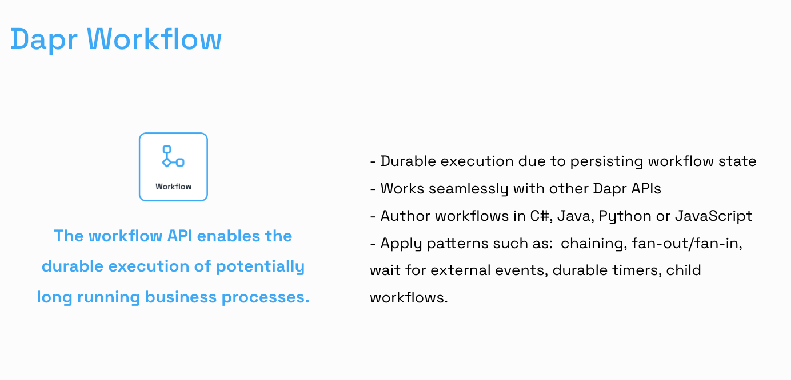

# [Dapr Workflows](https://docs.dapr.io/developing-applications/building-blocks/workflow/workflow-overview/)

In the Dapr Agentic Cloud Ascent (DACA) architecture, Dapr Workflow is a crucial building block. It empowers developers to orchestrate complex, AI-driven processes and coordinate multiple DACA agents effectively. Dapr Workflow is designed for building and managing stateful, long-running, and fault-tolerant applications, which are essential for sophisticated, production-grade AI systems.

Dapr Workflow provides a robust way to author and manage stateful, long-running, and fault-tolerant applications. It is particularly well-suited for orchestrating complex interactions between ai-apps and other Dapr building blocks like service invocation, pub/sub, state management, and bindings.

With Dapr Workflow, you can define business logic and integration processes that are resilient to failures and can run for extended periods.

By default, Dapr Workflow supports the Actors backend, which is stable and scalable. However, you can choose a different backend supported in Dapr Workflow. The backend implementation is largely decoupled from the workflow core engine or the programming model that you see. It primarily impacts:

- How workflow state is stored
- How workflow execution is coordinated across replicas

We will study details in workflows architecture.

Dapr Workflows are particularly adept at defining the logic for multi-step AI tasks, managing the lifecycle of agent operations, and ensuring the reliable execution of business processes that involve AI agents and other microservices. This capability aligns directly with DACA's primary goal of creating scalable, resilient, and maintainable agentic AI systems capable of operating at a planetary scale.

## Module Structure & Learning Path

This module is designed to guide you through Dapr Workflows, from foundational concepts to advanced DACA-specific implementations. Each subdirectory focuses on a specific aspect:

*   **`00_lab_starter_code/`**: Contains starter code, templates, and common utilities for the hands-on labs in this module.
*   **`01_hello_workflow/`**: Your first step into Dapr Workflows. Learn to set up, define, register, and run a basic workflow.
*   **`02_architecture_theory/`**: Delve into the underlying architecture of Dapr Workflows, understanding how the Dapr sidecar, workflow engine, and SDKs interact.
*   **`03_patterns/`**: Explore common and effective workflow design patterns (e.g., chaining, fan-out/fan-in, sagas, human interaction) and how to apply them.
*   **`04_author_workflows/`**: Focus on the practical aspects of writing workflow and activity logic using the Dapr Workflow SDK, including data passing, timers, and child workflows.
*   **`05_manage_workflows/`**: Learn how to interact with and manage workflow instances using the Dapr Workflow HTTP API (start, query, pause, resume, terminate, raise events, purge).
*   **`06_ai_pizza_shop/`**: A challenge to apply Dapr Workflows to build an AI-driven application (the "AI Pizza Shop"), integrating various concepts learned.
*   **`07_advanced_features/`**: Dive into advanced configurations, observability (metrics, tracing), in-depth error handling, testing strategies, and SDK-specific nuances for production-ready workflows.
*   **`08_a2a_daca/`**: Explore how Dapr Workflows can orchestrate complex Agent-to-Agent (A2A) communication and sophisticated interactions within the DACA ecosystem.

Follow these sections sequentially to build a comprehensive understanding of Dapr Workflows and their application in the Dapr Agentic Cloud Ascent (DACA) architecture.

Learning Resources:
- https://github.com/dapr/python-sdk/tree/main/examples/demo_workflow
- https://github.com/dapr/python-sdk/tree/main/ext/dapr-ext-workflow
- https://docs.dapr.io/developing-applications/building-blocks/workflow/workflow-overview/
-https://docs.dapr.io/reference/api/workflow_api/