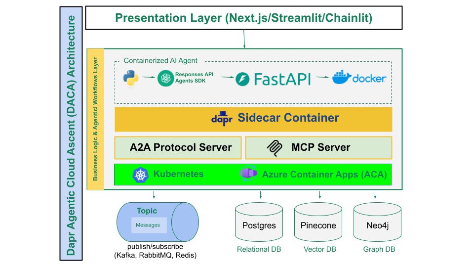
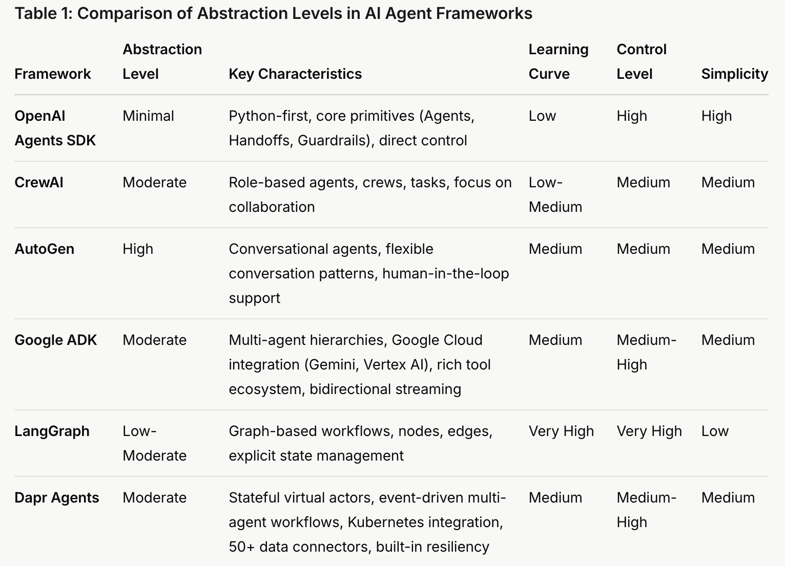

# Learn Agentic AI using Dapr Agentic Cloud Ascent (DACA) Design Pattern: From Start to Scale

This repo is part of the [Panaversity Certified Agentic & Robotic AI Engineer](https://docs.google.com/document/d/15usu1hkrrRLRjcq_3nCTT-0ljEcgiC44iSdvdqrCprk/edit?usp=sharing) program. It covers AI-201 and AI-202 courses.

**Complex Agentic AI Systems will be deployed on Cloud Native Technologies.**

## Our Dapr Agentic Cloud Ascent (DACA) Design Pattern

Let's understand and learn about "Dapr Agentic Cloud Ascent (DACA)", our winning design pattern for developing and deploying planet scale multi-agent systems:

https://grok.com/share/bGVnYWN5_c41dc0f7-8fcb-4d31-bbc0-1414d0a4e294 

**[Comprehensive Guide to Dapr Agentic Cloud Ascent (DACA) Design Pattern](https://github.com/panaversity/learn-agentic-ai/blob/main/comprehensive_guide_daca.md)**

### Core Libraries
- **OpenAI Agents SDK and Responses API**
- **Docker Containers**
- **Docker Compose**
- **CockroachDB**
- **CronJobs**
- **RabbitMQ**
- **MCP Server SDK**
- **Dapr**
- **Azure Container Apps**
- **Kubernetes**

### Target User
- **Agentic AI Developer and AgentOps Professionals**

**[OpenAI Agents SDK vs LangGraph vs Autogen vs CrewAI](https://composio.dev/blog/openai-agents-sdk-vs-langgraph-vs-autogen-vs-crewai/)**

The following chart clearly identifies why we are using OpenAI Agents SDK as our main framework for Agentic development:

[Abstraction and Power in AI Agent Frameworks: A Comparative Analysis of OpenAI Agents SDK, CrewAI, AutoGen, and LangGraph](https://g.co/gemini/share/e73d75492cf4)

Also listen to this discussion: 

[Listen: AI Agent Frameworks: OpenAI, CrewAI, AutoGen & LangGraph - Decoding the Power](https://g.co/gemini/share/5e4123e6bfeb)

### AI-201:  Fundamentals of Agentic AI -  From Foundations to DACA Distributed Agents
Kickstart your journey into Agentic AI! This foundational course provides an intensive introduction to Agentic AI, a cutting-edge field focused on building autonomous, intelligent systems with memories, Agentic RAG (Retrieval Augmented Generation) and standards based MCP (Model Context Protocol) tool calling. In this course our main focus will be to use Dapr Agentic Cloud Ascent (DACA) Design Pattern in the development stage locally. Students will first establish a strong understanding of the essential building blocks: Conversational and Generative AI. We will then rapidly progress into the exciting realm of prototyping Agentic AI systems using OpenAI Responses API and OpenAI Agents SDK, emphasizing practical application and hands-on skill development, including crucial aspects of Short and Long-Term Memories, Standardized Tools Calling (MCP), Agentic RAG, Prototype Deployment, and Observability. 

**[AI-201 Video Playlist](https://www.youtube.com/playlist?list=PL0vKVrkG4hWovpr0FX6Gs-06hfsPDEUe6)**

Note: These videos are for additional learning, and do not cover all the material taught in the onsite classes.

### AI-202: AI-202: DACA Medium Enterprise Scale Distributed Agents: Managed Serverless Platforms
Building directly upon the foundational principles learned in AI-201, AI-202 propels students into the forefront of Advanced Agentic AI Engineering. In this course our main focus will be to use Dapr Agentic Cloud Ascent (DACA) Design Pattern in the Medium Enterprise Scale: Azure Container Apps (ACA). This intensive course focuses on utilizing sophisticated libraries and frameworks, to design, develop, and deploy complex, enterprise-ready AI agent systems. Students will learn to create agents capable of sophisticated reasoning, intricate task execution, and collaborative problem-solving within multi-agent ecosystems.

Prerequisite: Successful completion of AI-201:  Fundamentals of Agentic AI -  From Foundations to DACA Distributed Agents.

### AI-301: DACA Planet-Scale Distributed Agents: Kubernetes with Self-Hosted LLMs
AI-301 represents the pinnacle of the Agentic AI Engineering series, uniquely focusing on the deployment of stateful and scalable AI Agents using Docker, Kubernetes, Dapr, and Cloud Native Model Context Protocol (MCP) Servers and APIs. (The upcoming version of MCP servers will support remote cloud deployment in addition to the current on‑premise setup.) In this course our main focus will be to use Dapr Agentic Cloud Ascent (DACA) Design Pattern in the Medium Enterprise Scale: Azure Container Apps (ACA). 
This intensive course equips students with the specialized skills to design, build, deploy, and scale highly performant, robust AI Agents in the cloud and cloud-native MCP infrastructure essential for advanced Agentic AI systems. You will master the complete lifecycle of creating production-ready, cloud-native MCP Servers and APIs, from backend development to cloud deployment, user-centered design, and robust operational practices. Learn to leverage a cutting-edge technology stack specifically to build scalable and efficient Cloud Native AI Agents and Cloud Native MCP solutions that underpin the next generation of intelligent agent applications.

Prerequisite: Successful completion of AI-201:  Fundamentals of Agentic AI -  From Foundations to DACA Distributed Agents.

